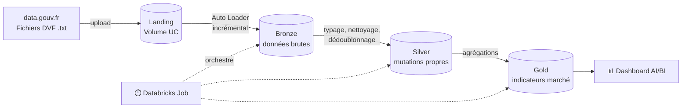

# 🏠 DVF Lakehouse — Pipeline data engineering sur le marché immobilier français


Pipeline de données de bout en bout construit sur **Databricks**, qui ingère, nettoie et modélise les
**Demandes de Valeurs Foncières (DVF)** — l'ensemble des ventes immobilières en France publié par la DGFiP —
(millésime 2025 dans un premier temps) afin de produire des indicateurs fiables sur le marché : **prix au m² par commune, par département et dans le temps**.

Le projet suit une **architecture médaillon** (Bronze → Silver → Gold) et met l'accent sur les bonnes pratiques
d'ingénierie : ingestion incrémentale, traçabilité, qualité de données et reproductibilité.

---

## 🎯 Objectifs

- Construire un pipeline **incrémental et idempotent** : un nouveau fichier déposé est traité une seule fois.
- Transformer une donnée brute réputée « sale » en tables analytiques fiables.
- Gérer les pièges métier du jeu DVF (ventes multi-lignes, prix répétés, doublons, formats français).
- Restituer les résultats dans un **dashboard** et orchestrer le tout via un **Job** planifié.

---

## 🏗️ Architecture



| Couche | Table(s) | Rôle |
|---|---|---|
| **Landing** | `immo.landing.dvf_raw` (Volume) | Fichiers bruts tels que téléchargés |
| **Bronze** | `immo.bronze.dvf_mutations` | Données brutes en Delta (tout en `string`) + métadonnées d'ingestion |
| **Silver** | `immo.silver.*` | Données typées, normalisées, dédoublonnées, avec identifiant de vente reconstruit |
| **Gold** | `immo.gold.*` | Indicateurs prêts à l'analyse : prix au m² médian, volumes de ventes, évolutions |

---

## 🔍 Défis de données traités

Le fichier DVF brut pose plusieurs problèmes, identifiés dès l'exploration :

| Problème | Exemple | Traitement |
|---|---|---|
| Pas d'identifiant de vente exploitable | `Identifiant de document` vide, `No disposition` toujours à `000001` | Reconstruction d'une clé de mutation (Silver) |
| Une vente = plusieurs lignes, prix répété | Maison + dépendance + terrain → 3 lignes à 468 000 € | Agrégation au niveau de la mutation pour éviter le double comptage |
| Lignes strictement dupliquées | Deux lignes « Dépendance » identiques | Dédoublonnage |
| Zéros de tête perdus | Code postal `1550` au lieu de `01550` | Reformatage des codes (postal, département, commune) |
| Formats français | `468000,00` · `07/01/2025` | Conversion en `decimal` et `date` |
| Noms de colonnes non compatibles Delta | `Surface reelle bati`, `B/T/Q` | Normalisation en `snake_case` dès le Bronze |

---

## 📁 Structure du dépôt

```
dvf-lakehouse/
├── README.md
├── setup/
│   └── 00_setup            # Création du catalogue, des schémas et des volumes
├── pipelines/
│   ├── 01_bronze_dvf       # Ingestion incrémentale avec Auto Loader
│   ├── 02_silver_dvf       # Typage, nettoyage, dédoublonnage
│   └── 03_gold_dvf         # Agrégations analytiques
└── exploration/            # Notebooks d'exploration et de tests
```

---

## 🚀 Reproduire le projet

### Prérequis
- Un compte [Databricks Free Edition](https://www.databricks.com/learn/free-edition)
- Un fichier DVF téléchargé depuis [data.gouv.fr — Demandes de valeurs foncières](https://www.data.gouv.fr/fr/datasets/demandes-de-valeurs-foncieres/)

### Étapes
1. **Cloner le dépôt** dans Databricks : *Workspace → Create → Git folder*, puis coller l'URL de ce dépôt.
2. **Initialiser l'environnement** : exécuter `setup/00_setup` (catalogue `immo`, schémas `landing`, `bronze`, `silver`, `gold`, volumes).
3. **Déposer les données** : uploader le fichier `ValeursFoncieres-XXXX.txt` dans le volume `immo.landing.dvf_raw`.
4. **Lancer le pipeline** dans l'ordre : `01_bronze_dvf` → `02_silver_dvf` → `03_gold_dvf`.

> ℹ️ Les données ne sont pas versionnées dans ce dépôt : elles sont publiques et téléchargeables sur data.gouv.fr.

---

## 🧠 Choix techniques

- **Auto Loader + checkpoint** : seuls les nouveaux fichiers sont ingérés ; relancer le pipeline ne duplique pas les données.
- **`trigger(availableNow=True)`** : traitement par lots incrémental, adapté au calcul serverless et à une exécution planifiée.
- **Schéma explicite en `string` au Bronze** : aucune inférence de type, donc aucune perte d'information (ex. zéros de tête) ; le typage est fait en Silver, de façon contrôlée et rejouable.
- **Traçabilité** : chaque ligne Bronze conserve son fichier source (`_source_file`) et sa date d'ingestion (`_ingested_at`).
- **Unity Catalog** : gouvernance centralisée des tables et des volumes.

---

## 🗺️ Feuille de route

- [x] Mise en place du catalogue, des schémas et des volumes
- [ ] Ingestion Bronze incrémentale (Auto Loader)
- [ ] Couche Silver : typage, nettoyage, clé de mutation, dédoublonnage
- [ ] Couche Gold : prix au m² par commune / département / mois
- [ ] Dashboard AI/BI
- [ ] Orchestration via un Databricks Job
- [ ] **V2** : migration vers Lakeflow Declarative Pipelines avec *expectations* de qualité
- [ ] Ingestion multi-années

---

## 🛠️ Stack

**Databricks Free Edition** (serverless) · **PySpark** · **Spark SQL** · **Delta Lake** · **Auto Loader** · **Unity Catalog** · **Git folders / GitHub**

---

## 📄 Source des données

Demandes de valeurs foncières — Direction Générale des Finances Publiques (DGFiP), diffusées sur
[data.gouv.fr](https://www.data.gouv.fr/fr/datasets/demandes-de-valeurs-foncieres/) sous Licence Ouverte / Open Licence.

---

## 👤 Auteur

**Etienne Girard** — [GitHub](https://github.com/etienneg92i) · *LinkedIn : à compléter*
